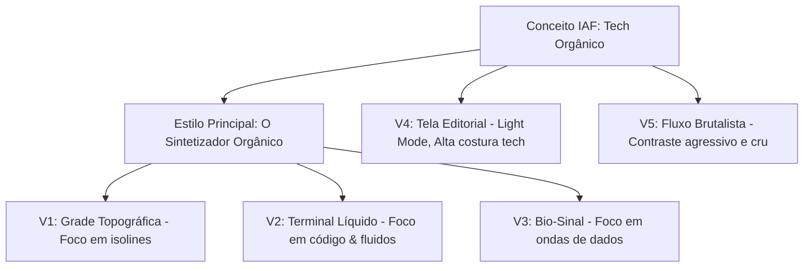

# Briefing de Identidade Visual — IA que Funciona (IAF)

Este documento estabelece as diretrizes conceituais e estéticas para a identidade visual da **IA que Funciona (IAF)**, uma comunidade de praticantes e entusiastas de inteligência artificial generativa. A identidade codifica uma alma pragmática (focada em utilidade e resultados reais) combinada a um espírito audacioso e inovador (explorador, criativo e pioneiro).

---

## 1. Conceito Central: "O Fluxo Pragmático" (Organic Tech)

A inteligência artificial generativa é frequentemente associada a duas estéticas clichês de startups:
1. **O Vazio Corporativo / Minimalismo Asséptico**: Degradês roxos e azuis ultra-saturados, formas arredondadas genéricas (blobs), fontes geométricas sem serifa sem personalidade.
2. **O Tecno-Caos Futurista**: Interfaces escuras com matrizes verdes inspiradas em Matrix, elementos cyberpunk e ruído desnecessário.

A **IAF** se posiciona fora dessas convenções. Buscamos uma estética **Tech-Orgânica**:
- **Pragmática (A Estrutura)**: Uso de grades editoriais precisas, tipografia de alta legibilidade, contraste acentuado e foco absoluto no conteúdo.
- **Audaciosa & Orgânica (O Fluxo)**: Linhas curvas suaves, orgânicas e contínuas que serpenteiam a interface. Elas representam caminhos generativos, conexões neurais fluidas, e a maleabilidade das IAs em contraste com a rigidez dos sistemas tradicionais.

O elemento central é a **curva de Bézier fluida**, que atua como separador de seções, vetor decorativo ou linha guia para o olhar do usuário.

---

## 2. Elementos da Identidade

### A. Paleta de Cores
O tom **Azul Teal** é o protagonista. Ele une a seriedade técnica do azul com a vitalidade e frescor orgânico do verde.

- **Teal Principal (Accent)**: `#0da69e` (Teal vibrante e profundo, equilibrando luz e sobriedade)
- **Teal Neon (Highlight)**: `#00ffd5` (Usado para interações críticas, hover e pontos de foco)
- **Fundo Escuro (Base)**: `#080d0f` (Um cinza-chumbo quase preto, com um toque levemente azulado para evitar o preto absoluto sem vida)
- **Terracota Quente (Complementar)**: `#e07a5f` (Contraponto quente de terra e cobre, representando o pragmatismo e a ancoragem humana no mundo real)
- **Verde Musgo (Secundário Orgânico)**: `#8f9e8b` (Representa redes neurais, sinapses, e a maleabilidade das conexões biológicas)
- **Âmbar Latente (Alerta/Secundário)**: `#ffb700` (Para realces pontuais e estados de telemetria sem poluição visual)
- **Muted Teal (Suporte)**: `#1c2b30` (Para bordas, cards e elementos secundários)
- **Off-White (Texto)**: `#f3f6f6` (Para leitura de alto conforto e contraste)

### B. Tipografia
Proposta de combinação de fontes do Google Fonts:
- **Títulos & Destaques**: `Outfit` (Sans-serif geométrica com cantos suaves, limpa e moderna) ou `Syne` (para variantes brutais).
- **Código & Dados Técnico**: `JetBrains Mono` ou `Fira Code` (Monospaced pragmática, representando o código e a engenharia).
- **Corpo de Texto**: `Inter` (A referência máxima em legibilidade digital e clareza).

### C. Grafismos (Linhas Curvas Suaves)
As curvas não devem ser usadas como "fundo decorativo aleatório". Elas representam fluxos de dados e devem:
- Conectar elementos textuais de forma física ou conceitual.
- Servir como caminhos dinâmicos (desenhados via Canvas ou SVG com animação de traço).
- Evocar a sensação de um sinal osciloscópico orgânico, um vetor de aprendizado de máquina ou curvas de nível topográficas.

---

## 3. Direção Estética Principal e Variantes

Apresentamos o estilo principal, seguido por 3 variações próximas (explorando o mesmo ecossistema visual) e 2 variações alternativas (com abordagens conceituais distintas).

### Estilo Principal: "O Sintetizador Orgânico" (O Padrão)
* **Atmosfera**: Interface escura (`#080d0f`), extremamente limpa, com curvas de Bézier finas e brilhantes em azul teal que guiam o fluxo de leitura de um bloco para o outro.
* **Tipografia**: `Outfit` (Títulos) + `Inter` (Texto) + `Fira Code` (Tags/Status).
* **Uso da Curva**: Linhas simples, contínuas, de 1px a 1.5px de espessura, com gradientes suaves de teal para azul escuro.

---

### Variantes Muito Próximas (Mesmo DNA)

#### Variante 1: "A Grade Topográfica"
* **Conceito**: Linhas curvas que se sobrepõem simulando curvas de nível (topografia), sugerindo a exploração de um território desconhecido (o espaço latente da IA).
* **Cores**: Fundo `#0d171b` (levemente mais claro) com linhas de contorno em teal muted (`#1c383a`) e acentos em teal neon (`#00ffd5`).
* **Tipografia**: Introduz `Space Grotesk` para títulos, mantendo um tom de precisão cartográfica.
* **Uso da Curva**: Linhas paralelas curvas que formam relevos no fundo de cards ou seções.

#### Variante 2: "O Terminal Líquido"
* **Conceito**: Foco total no pragmatismo dos desenvolvedores e engenheiros de prompt. É uma interface de terminal pura, mas que "derrete" ou flui organicamente nos cantos.
* **Cores**: Preto puro (`#000000`) e verde-teal fosforescente (`#00f0ff`).
* **Tipografia**: Predominância de `JetBrains Mono` em todo o layout.
* **Uso da Curva**: As linhas curvas emergem de blocos de código e dados, parecendo "fios líquidos" que interligam as entradas de dados.

#### Variante 3: "O Bio-Sinal"
* **Conceito**: Remete a exames de biologia e telemetria. A IA como um organismo vivo cujo pulso pode ser medido.
* **Cores**: Azul-teal pastel/desaturado (`#4ca6a4`), fundo cinza-petróleo escuro (`#0a1012`) e detalhes em branco cirúrgico.
* **Tipografia**: `DM Sans` + `Fira Code`.
* **Uso da Curva**: Linhas semelhantes a batimentos cardíacos ou ondas senoidais perfeitamente suavizadas que oscilam de acordo com as seções da página.

---

### Variantes Menos Próximas (Caminhos Alternativos)

#### Variante 4: "A Tela Editorial" (Light Mode Premium)
* **Conceito**: Foge do esteriótipo de "tela de computador" e se inspira em revistas de design de luxo e arquitetura moderna. A IA tratada como cultura e design intelectual.
* **Cores**: Fundo areia/warm off-white (`#f7f9f6`), texto em azul-teal profundo/quase preto (`#082a29`) e acentos em teal brilhante (`#00ad9c`).
* **Tipografia**: `Cormorant Garamond` (uma serifa clássica refinada para títulos gigantes) + `Inter` (texto).
* **Uso da Curva**: Grandes massas de formas curvas (silhuetas orgânicas cheias) que agem como molduras e transições de página, como se fossem esculturas físicas.

#### Variante 5: "O Fluxo Brutalista" (Raw & Energetic)
* **Conceito**: Uma estética de impacto imediato, sem sutilezas, focando na força crua da tecnologia e da comunidade que "faz a IA funcionar" na marra.
* **Cores**: Fundo cinza escuro industrial (`#12151a`), acentos em Teal Neon "Tóxico" (`#00ffd5`) e detalhes em Laranja de Advertência (`#ff5500`).
* **Tipografia**: `Syne` (Títulos pesados e ultra-largos) + `Space Mono`.
* **Uso da Curva**: Curvas espessas, ruidosas, com cantos que desafiam as grades retas tradicionais. Bordas grossas de 2px e grids visíveis com interseções curvas de metal.

---

## 4. Estrutura do Teste em Código (Playroom)

Para demonstrar esse briefing em prática, criamos um painel interativo (Playroom) que renderiza um protótipo funcional de página da comunidade (a Landing Page da IAF) e permite alternar instantaneamente entre a direção de design principal e as 5 variações através de injeção dinâmica de CSS Variables.

Isso nos permite validar:
1. **Sensibilidade do Contraste**: Como as cores funcionam em diferentes modos e tons de teal.
2. **Harmonia Tipográfica**: A mudança de humor do projeto apenas trocando as fontes.
3. **Comportamento das Curvas**: Como as curvas (desenhadas com SVG e Canvas) interagem com o conteúdo.
